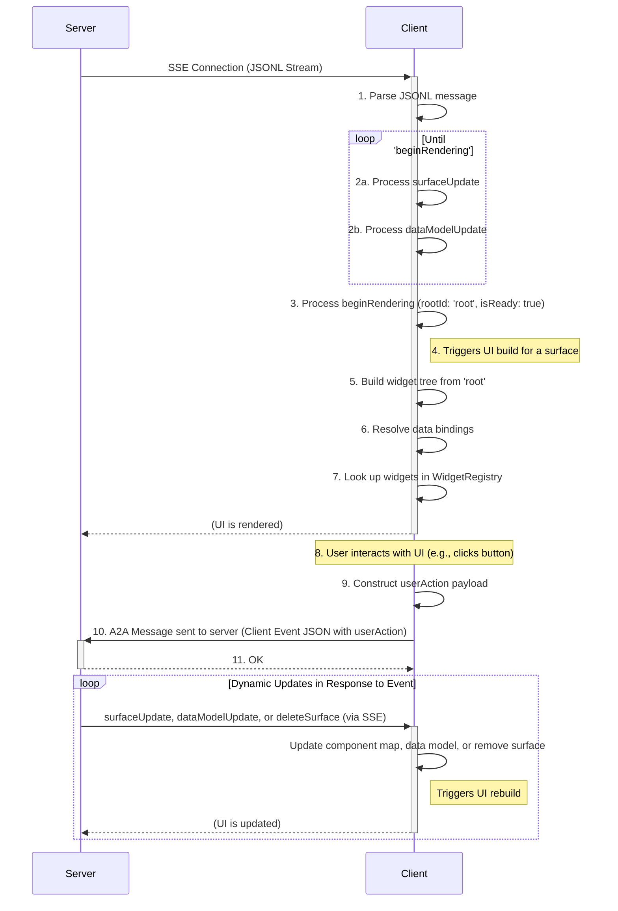
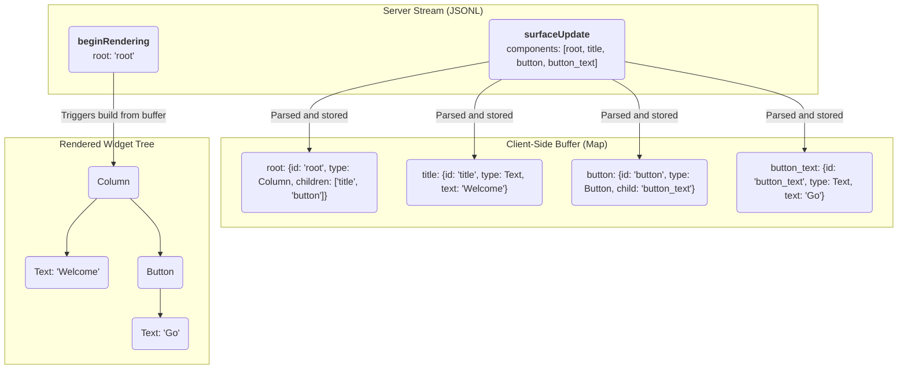

<!-- markdownlint-disable MD041 -->
<!-- markdownlint-disable MD033 -->
<div style="text-align: center;">
  <div class="centered-logo-text-group">
    
    <h1>A2UI (Agent to UI) Protocol</h1>
  </div>
</div>

A Specification for a JSONL-Based, Streaming UI Protocol

Created: Sep 19, 2025
Updated: Nov 12, 2025

## Design requirements

The A2UI (Agent to UI) protocol should be a system where an LLM can stream a platform-agnostic, abstract UI definition to a client, which then renders it progressively using a native widget set. Every major design choice is traced back to the core challenges of LLM generation, perceived performance, and platform independence.

### Requirement: The protocol must be easily generated by a Transformer Large Language Model (LLM)

This is the most critical driver. This requirement directly leads to several design choices:

Declarative, Simple Structure: The protocol should use a straightforward, declarative format ("this is a column with these children") rather than an imperative one ("now, add a column; then, append a text widget to it"). LLMs excel at generating structured, declarative data.

Flat Component List (Adjacency List): Requiring an LLM to generate a perfectly nested JSON tree in a single pass is difficult and error-prone. A flat list of components, where relationships are defined by simple string IDs, is much easier to generate piece by piece. The model can "think" of a component, give it an ID, and then reference that ID later without worrying about tree depth or object nesting.

Stateless Messages: Each JSONL message is a self-contained unit of information (componentUpdate, dataModelUpdate). This is ideal for a streaming LLM, which can output these messages incrementally as it processes a request.

### Requirement: The UI must render progressively for a fast, responsive user experience

The system must feel fast to the user, even if the full UI is complex and takes time to generate.

Streaming via JSONL/SSE: This is a direct solution. The client doesn't have to wait for a single, massive JSON payload. It can start receiving and processing UI components immediately, improving perceived performance.

### Requirement: The protocol must be platform-agnostic

The same server-side logic should be able to render a UI on a Flutter app, a web browser, or potentially other platforms without modification.

Client-Defined widget catalog: This is the core of the platform-agnostic design. The protocol should define an abstract component tree (e.g., "I need a Card with a Row inside"). It is the client's responsibility to map these abstract types to its native widget implementations (a Flutter Card widget, an HTML `<div>` with card styling, etc.). The server only needs to know the names of the components the client supports.

### Requirement: State management must be efficient and decoupled from the UI structure

Changing a piece of text in the UI should not require resending the entire UI definition.

Separation of Data and Components: Having distinct componentUpdate and data model update messages is key. The UI structure can be sent once, and subsequent updates can be small dataModelUpdate messages that only contain the changed data.

### Requirement: The communication architecture must be robust and scalable

The system needs a clear, reliable way to handle both server-pushed UI and client-initiated events.

Unidirectional UI Stream: Using a one-way stream (SSE) for UI updates simplifies the client's logic. It only needs to listen and react. This is a more robust pattern for server-push than trying to manage a complex bidirectional channel.

Event Handling: Event handling is done via an A2A message from the client to the server agent

## Introduction

The A2UI Protocol is a protocol designed for rendering user interfaces from a stream of JSON objects sent from a server. Its core philosophy emphasizes a clean separation of UI structure and application data, enabling progressive rendering as the client processes each message.

The protocol is designed to be "LLM-friendly," meaning its structure is declarative and straightforward, making it easy for a generative model to produce. A core feature of A2UI is its extensible component model. The set of available UI components is not fixed by the protocol but is defined in a separate **Catalog**, allowing for platform-specific or custom components.

Communication occurs via a JSON Lines (JSONL) stream. The client parses each line as a distinct message and incrementally builds the UI. The server-to-client protocol defines four message types:

- `surfaceUpdate`: Provides a list of component definitions to be added to or updated in a specific UI area called a "surface."
- `dataModelUpdate`: Provides new data to be inserted into or to replace a surface's data model. Each surface has its own data model.
- `beginRendering`: Signals to the client that it has enough information to perform the initial render, specifying the ID of the root component and, optionally, the component catalog to use.
- `deleteSurface`: Explicitly removes a surface and its contents from the UI.

Client-to-server communication for user interactions is handled separately via an A2A message. This message can be one of two types:

- `userAction`: Reports a user-initiated action from a component.
- `error`: Reports a client-side error.
  This keeps the primary data stream unidirectional.

## Section 1: Foundational architecture and data flow

This document specifies the architecture and data formats for the A2UI protocol. The design is guided by principles of strict separation of concerns, versioning, and progressive rendering.

### 1.1. Core philosophy: decoupling and contracts

The central philosophy of A2UI is the decoupling of three key elements:

1.  **The Component Tree (The Structure):** A server-provided tree of abstract components that describes the UI's structure. This is defined by `surfaceUpdate` messages.
2.  **The Data Model (The State):** A server-provided JSON object containing the dynamic values that populate the UI, such as text, booleans, or lists. This is managed via `dataModelUpdate` messages.
3.  **The Widget Registry (The "Catalog"):** A client-defined mapping of component types (e.g., "Row", "Text") to concrete, native widget implementations. This registry is **part of the client application**, not the protocol stream. The server must generate components that the target client's registry understands.

### 1.2. The JSONL stream: The unit of communication

All UI descriptions are transmitted from the server to the client as a stream of JSON objects, formatted as JSON Lines (JSONL). Each line is a separate, compact JSON object representing a single message. This allows the client to parse and process each part of the UI definition as it arrives, enabling progressive rendering.

### 1.3. Surfaces: Managing Multiple UI Regions

A **Surface** is a contiguous portion of screen real estate into which a A2UI UI can be rendered. The protocol introduces the concept of a `surfaceId` to uniquely identify and manage these areas. This allows a single A2UI stream to control multiple, independent UI regions simultaneously. Each surface has a separate root component and a separate hierarchy of components. Each surface has a separate data model, to avoid collision of keys when working with a large number of surfaces.

For example, in a chat application, each AI-generated response could be rendered into a separate surface within the conversation history. A separate, persistent surface could be used for a side panel that displays related information.

The `surfaceId` is a property within each server-to-client message that directs changes to the correct area. It is used with messages like `beginRendering`, `surfaceUpdate`, `dataModelUpdate`, and `deleteSurface` to target a specific surface.

### 1.4. Data Flow Model

The A2UI protocol is composed of a server-to-client stream describing UI and individual events sent to the server. The client consumes the stream, builds the UI, and renders it. Communication occurs via a JSON Lines (JSONL) stream, typically transported over **Server-Sent Events (SSE)**.

1.  **Server Stream:** The server begins sending the JSONL stream over an SSE connection.
2.  **Client-Side Buffering:** The client receives messages and buffers them:

    - `surfaceUpdate`: Component definitions are stored in a `Map<String, Component>`, organized by `surfaceId`. If a surface doesn't exist, it is created.
    - `dataModelUpdate`: The client's internal JSON data model is built or updated.

3.  **Render Signal:** The server sends a `beginRendering` message with the `root` component's ID. This prevents a "flash of incomplete content." The client buffers incoming components and data but waits for this explicit signal before attempting the first render, ensuring the initial view is coherent.
4.  **Client-Side Rendering:** The client, now in a "ready" state, starts at the `root` component. It recursively walks the component tree by looking up component IDs in its buffer. It resolves any data bindings against the data model and uses its `WidgetRegistry` to instantiate native widgets.
5.  **User Interaction and Event Handling:** The user interacts with a rendered widget (e.g., taps a button). The client constructs a `userAction` JSON payload, resolving any data bindings from the component's `action.context`. It sends this payload to the server via an A2A message.
6.  **Dynamic Updates:** The server processes the `userAction`. If the UI needs to change in response, the server sends new `surfaceUpdate` and `dataModelUpdate` messages over the original SSE stream. As these arrive, the client updates its component buffer and data model, and the UI re-renders to reflect the changes. The server can also send `deleteSurface` to remove a UI region.



### 1.5. Full Stream Example

The following is a complete, minimal example of a JSONL stream that renders a user profile card.

```jsonl
{"surfaceUpdate": {"components": [{"id": "root", "component": {"Column": {"children": {"explicitList": ["profile_card"]}}}}]}}
{"surfaceUpdate": {"components": [{"id": "profile_card", "component": {"Card": {"child": "card_content"}}}]}}
{"surfaceUpdate": {"components": [{"id": "card_content", "component": {"Column": {"children": {"explicitList": ["header_row", "bio_text"]}}}}]}}
{"surfaceUpdate": {"components": [{"id": "header_row", "component": {"Row": {"alignment": "center", "children": {"explicitList": ["avatar", "name_column"]}}}}]}}
{"surfaceUpdate": {"components": [{"id": "avatar", "component": {"Image": {"url": {"literalString": "https://www.example.com/profile.jpg"}}}}]}}
{"surfaceUpdate": {"components": [{"id": "name_column", "component": {"Column": {"alignment": "start", "children": {"explicitList": ["name_text", "handle_text"]}}}}]}}
{"surfaceUpdate": {"components": [{"id": "name_text", "component": {"Text": {"usageHint": "h3", "text": {"literalString": "A2A Fan"}}}}]}}
{"surfaceUpdate": {"components": [{"id": "handle_text", "component": {"Text": {"text": {"literalString": "@a2a_fan"}}}}]}}
{"surfaceUpdate": {"components": [{"id": "bio_text", "component": {"Text": {"text": {"literalString": "Building beautiful apps from a single codebase."}}}}]}}
{"dataModelUpdate": {"contents": {}}}
{"beginRendering": {"root": "root"}}
```

## Section 2: The Component Model

A2UI's component model is designed for flexibility, separating the protocol from the component set.

### 2.1. Catalog Negotiation

A **Catalog** defines the contract between the server and the client for the UI that can be rendered. It contains a list of supported component types (e.g., `Row`, `Text`), their properties, and available styles. A catalog is defined by a **Catalog Definition Document**.

There is a **Standard Catalog** associated with each version of the A2UI protocol. For v0.8, its identifier is `https://a2ui.org/specification/v0_8/standard_catalog_definition.json`.

Catalog IDs are simple string identifiers. While they can be anything, it is conventional to use a URI within a domain that you own, to simplify debugging, avoid confusion, and avoid name collisions. Furthermore, if any changes are made to a catalog that could break compatibility between an agent and renderer, a new `catalogId` **must** be assigned. This ensures clear versioning and prevents unexpected behavior if an agent has changes but the client does not, or vice versa.

The negotiation process allows the client and server to agree on which catalog to use for a given UI surface. This process is designed to be flexible, supporting standard, custom, and even dynamically-defined catalogs.

The flow is as follows:

#### 1. Server Advertises Capabilities

The server (agent) advertises its capabilities in its Agent Card as part of the A2A protocol. For A2UI, this includes which catalogs it supports and whether it can handle catalogs defined inline by the client.

- `supportedCatalogIds` (array of strings, optional): A list of IDs for all pre-defined catalogs the agent is known to support.
- `acceptsInlineCatalogs` (boolean, optional): If `true`, the server can process `inlineCatalogs` sent by the client. Defaults to `false`.

**Example Server Agent Card Snippet:**
```json
{
  "name": "Restaurant Finder",
  "capabilities": {
    "extensions": [
      {
        "uri": "https://a2ui.org/a2a-extension/a2ui/v0.8",
        "params": {
          "supportedCatalogIds": [
            "https://a2ui.org/specification/v0_8/standard_catalog_definition.json",
            "https://my-company.com/a2ui/v0.8/my_custom_catalog.json"
          ],
          "acceptsInlineCatalogs": true
        }
      }
    ]
  }
}
```

Note that this is not a strict contract and purely included as a signal to help orchestrators and clients identify agents with matching UI capabilities. At runtime, orchestrating agents may dynamically delegate tasks to subagents which support additional catalogs that the orchestrating agent did not advertise. Thus, clients should consider the advertised supportedCatalogIds as a subset of the true catalogs that the agent or its subagents may support.

#### 2. Client Declares Supported Catalogs

In **every** message sent to the server, the client includes an `a2uiClientCapabilities` object within the A2A `Message` metadata. This object informs the agent server of all catalogs the client can render.

- `supportedCatalogIds` (array of strings, required): A list of identifiers for all pre-defined catalogs the client supports. The client must explicitly include the standard catalog ID here if it supports the standard catalog. The contents of these catalogs are expected to be compiled into the agent server and not downloaded at runtime, in order to prevent malicious content being injected into the prompt dynamically, and ensure predictable results.
- `inlineCatalogs` (array of objects, optional): An array of full Catalog Definition Documents. This allows a client to provide custom, on-the-fly catalogs, typically for use in local development workflows where it is faster to update a catalog in one place on the client. This may only be provided if the server has advertised `acceptsInlineCatalogs: true`.

**Example A2A Message with Client Capabilities:**
```json
{
  "metadata": {
    "a2uiClientCapabilities": {
      "supportedCatalogIds": [
        "https://a2ui.org/specification/v0_8/standard_catalog_definition.json",
        "https://my-company.com/a2ui_catalogs/custom-reporting-catalog-1.2"
      ],
      "inlineCatalogs": [
        {
          "catalogId": "https://my-company.com/inline_catalogs/temp-signature-pad-catalog",
          "components": {
            "SignaturePad": {
              "type": "object",
              "properties": { "penColor": { "type": "string" } }
            }
          },
          "styles": {}
        }
      ]
    }
  },
  "message": {
    "prompt": {
      "text": "Find me a good restaurant"
    }
  }
}
```

#### 3. Server Chooses Catalog and Renders

The server receives the client's capabilities and chooses a catalog to use for a specific UI surface. The server specifies its choice in the `beginRendering` message using the `catalogId` field.

- `catalogId` (string, optional): The identifier of the chosen catalog. This ID must be one of the `supportedCatalogIds` or the `catalogId` from one of the `inlineCatalogs` provided by the client.

If the `catalogId` is omitted, the client **MUST** default to the standard catalog for the protocol version (`https://a2ui.org/specification/v0_8/standard_catalog_definition.json`).

**Example `beginRendering` Message:**
```json
{
  "beginRendering": {
    "surfaceId": "unique-surface-1",
    "catalogId": "https://my-company.com/inline_catalogs/temp-signature-pad-catalog",
    "root": "root-component-id"
  }
}
```

Each surface can use a different catalog, providing a high degree of flexibility, particularly in multi-agent systems where different agents may support different catalogs.

#### Schemas for Developers

When building an agent, it is recommended to use a resolved schema that includes the specific component catalog you are targeting (e.g., a custom schema combining `server_to_client.json` with your `https://my-company.com/a2ui_catalogs/custom-reporting-catalog-1.2` definition). This provides the LLM with a strict definition of all available components and their properties, as well as the catalog-specific styles, leading to more reliable UI generation. The generic `server_to_client.json` is the abstract wire protocol, while the resolved schema is the concrete tool for generation.

In order to do the substitution, based on the standard `server_to_client_schema` and a `custom_catalog_definition` object, you can use JSON manipulation logic similar to:

```py
component_properties = custom_catalog_definition["components"]
style_properties = custom_catalog_definition["styles"]
resolved_schema = copy.deepcopy(server_to_client_schema)

resolved_schema["properties"]["surfaceUpdate"]["properties"]["components"]["items"]["properties"]["component"]["properties"] = component_properties
resolved_schema["properties"]["beginRendering"]["properties"]["styles"]["properties"] = style_properties
```

See `server_to_client_with_standard_catalog.json` for an example of a resolved
schema which has the components substituted in.

### 2.2. The `surfaceUpdate` Message

This message is the primary way UI structure is defined. It contains a `surfaceId` and a `components` array.

```json
{
  "surfaceUpdate": {
    "surfaceId": "main_content_area",
    "components": [
      {
        "id": "unique-component-id",
        "component": {
          "Text": {
            "text": { "literalString": "Hello, World!" }
          }
        }
      },
      {
        "id": "another-component-id",
        "component": { ... }
      }
    ]
  }
}
```

- `components`: A required flat list of component instances.

### 2.3. The Component Object

Each object in the `components` array has the following structure:

- `id`: A required, unique string that identifies this specific component instance. This is used for parent-child references.
- `component`: A required object that defines the component's type and properties.

### 2.4.`component` (Generic Object)

On the wire, this object is generic. Its structure is not defined by the core A2UI protocol. Instead, its validation is based on the active **Catalog**. It is a wrapper object that **must** contain exactly one key, where the key is the string name of the component type from the catalog (e.g., `"Text"`, `"Row"`). The value is an object containing the properties for that component, as defined in the catalog.

**Example:** A `Text` component:

```json
"component": {
  "Text": {
    "text": { "literalString": "This is text" }
  }
}
```

A `Button` component:

```json
"component": {
  "Button": {
    "label": { "literalString": "Click Me" },
    "action": { "name": "submit_form" }
  }
}
```

The full set of available component types and their properties is defined by a **Catalog Schema**, not in the core protocol schema.

## Section 3: UI Composition

### 3.1. The Adjacency List Model

The A2UI protocol defines the UI as a flat list of components. The tree structure is built implicitly using ID references. This is known as an adjacency list model.

Container components (like `Row`, `Column`, `List`, `Card`) have properties that reference the `id` of their child component(s). The client is responsible for storing all components in a map (e.g., `Map<String, Component>`) and recreating the tree structure at render time.

This model allows the server to send component definitions in any order, as long as all necessary components are present by the time `beginRendering` is sent.



### 3.2. Container Children: `explicitList` vs. `template`

Container components (`Row`, `Column`, `List`) define their children using a `children` object, which must contain _either_ `explicitList` or `template`.

- `explicitList`: An array of component `id` strings. This is used for static, known children.
- `template`: An object used to render a dynamic list of children from a data-bound list.

```json
{
  "type": "object",
  "description": "Defines the children of a container component. Must contain exactly one of `explicitList` or `template`.",
  "properties": {
    "explicitList": {
      "type": "array",
      "description": "An ordered list of component IDs that are direct children.",
      "items": {
        "type": "string",
        "description": "The ID of a child component."
      }
    },
    "template": {
      "type": "object",
      "description": "Defines a template for rendering dynamic lists of children.",
      "properties": {
        "dataBinding": { "$ref": "#/definitions/DataPath" },
        "componentId": {
          "type": "string",
          "description": "The ID of the component to use as a template for each item in the data-bound list."
        }
      },
      "required": ["dataBinding", "componentId"],
      "additionalProperties": false
    }
  },
  "minProperties": 1,
  "maxProperties": 1
}
```

### 3.3. Dynamic List Rendering with `template`

To render dynamic lists, a container uses the `template` property.

1.  `dataBinding`: A path to a list in the data model (e.g., `/user/posts`).
2.  `componentId`: The `id` of another component in the buffer to use as a template for each item in the list.

The client will iterate over the list at `dataBinding` and, for each item, render the component specified by `componentId`. The item's data is made available to the template component for relative data binding.

## Section 4: Dynamic Data & State Management

A2UI enforces a clean separation between the UI's structure (components) and its dynamic data (data model).

### 4.1. The `dataModelUpdate` Message

This message is the only way to modify the client's data model.

- `surfaceId`: The unique identifier for the UI surface this data model update applies to.
- `path`: An optional path to a location within the data model (e.g., '/user/name'). If omitted, the update applies to the root of the data model.
- `contents`: An array of data entries arranged as an adjacency list. Each entry must contain a 'key' and exactly one corresponding typed 'value\*' property (e.g. `valueString`, `valueNumber`, `valueBoolean`, `valueMap`).
  - `valueMap`: A JSON object representing a map as an adjacency list.

#### Example: Updating the data model

```json
{
  "dataModelUpdate": {
    "surfaceId": "main_content_area",
    "path": "user",
    "contents": [
      { "key": "name", "valueString": "Bob" },
      { "key": "isVerified", "valueBoolean": true },
      {
        "key": "address",
        "valueMap": [
          { "key": "street", "valueString": "123 Main St" },
          { "key": "city", "valueString": "Anytown" }
        ]
      }
    ]
  }
}
```

### 4.2. Data Binding (The `BoundValue` Object)

Components connect to the data model through binding. Any property that can be data-bound (like `text` on a `Text` component) accepts a `BoundValue` object. This object defines either a literal value, a data path, or both as a shorthand for initialization.

From the catalog schema, a bound `text` property looks like this:

```json
{
  "type": "object",
  "description": "A value that can be either a literal string or bound to the data model.",
  "properties": {
    "literalString": {
      "type": "string",
      "description": "A static string value."
    },
    "path": { "$ref": "#/definitions/DataPath" }
  },
  "minProperties": 1,
  "additionalProperties": false
}
```

A component can also bind to numbers (`literalNumber`), booleans (`literalBoolean`), or arrays (`literalArray`). The behavior depends on which properties are provided:

- **Literal Value Only**: If only a `literal*` value (e.g., `literalString`) is provided, the value is static and displayed directly.

  ```json
  "text": { "literalString": "Hello" }
  ```

- **Path Only**: If only `path` is provided, the value is dynamic. It's resolved from the data model at render time.

  ```json
  "text": { "path": "/user/name" }
  ```

- **Path and Literal Value (Initialization Shorthand)**: If **both** `path` and a `literal*` value are provided, it serves as a shorthand for data model initialization. The client MUST:

  1.  Update the data model at the specified `path` with the provided `literal*` value. This is an implicit `dataModelUpdate`.
  2.  Bind the component property to that `path` for rendering and future updates.

  This allows the server to set a default value and bind to it in a single step.

  ```json
  // This initializes data model at '/user/name' to "Guest" and binds to it.
  "text": { "path": "/user/name", "literalString": "Guest" }
  ```

The client's interpreter is responsible for resolving these paths against the data model before rendering. The A2UI protocol supports direct 1:1 binding; it does not include transformers (e.g., formatters, conditionals). Any data transformation must be performed by the server before sending it in a `dataModelUpdate`.

## Section 5: Event Handling

While the server-to-client UI definition is a one-way stream (e.g., over SSE), user interactions are communicated back to the server using an A2A message.

### 5.1. The Client Event Message

The client sends a single JSON object that acts as a wrapper. It must contain exactly one of the following keys: `userAction` or `error`.

### 5.2. The `userAction` Message

This message is sent when the user interacts with a component that has an action defined. It is the primary mechanism for user-driven events.

The `userAction` object has the following structure:

- `name` (string, required): The name of the action, taken directly from the `action.name` property of the component (e.g., "submit_form").
- `surfaceId` (string, required): The `id` of the surface where the event originated.
- `sourceComponentId` (string, required): The `id` of the component that triggered the event (e.g., "my_button").
- `timestamp` (string, required): An ISO 8601 timestamp of when the event occurred (e.g., "2025-09-19T17:01:00Z").
- `context` (object, required): A JSON object containing the key-value pairs from the component's `action.context`, after resolving all `BoundValue`s against the data model.

The process for resolving the `action.context` remains the same: the client iterates over the `context` array, resolves all literal or data-bound values, and constructs the `context` object.

### 5.3. The `error` Message

This message provides a feedback mechanism for the server. It is sent when the client encounters an error, for instance, during UI rendering or data binding. The content of the object is flexible and can contain any relevant error information.

### 5.4. Event Flow Example (`userAction`)

1.  **Component Definition** (from `surfaceUpdate`):

    ```json
    {
      "surfaceUpdate": {
        "surfaceId": "main_content_area",
        "components": [
          {
            "id": "submit_btn_text",
            "component": {
              "Text": {
                "text": { "literalString": "Submit" }
              }
            }
          },
          {
            "id": "submit_btn",
            "component": {
              "Button": {
                "child": "submit_btn_text",
                "action": {
                  "name": "submit_form",
                  "context": [
                    {
                      "key": "userInput",
                      "value": { "path": "/form/textField" }
                    },
                    { "key": "formId", "value": { "literalString": "f-123" } }
                  ]
                }
              }
            }
          }
        ]
      }
    }
    ```

2.  **Data Model** (from `dataModelUpdate`):

    ```json
    {
      "dataModelUpdate": {
        "surfaceId": "main_content_area",
        "path": "form",
        "contents": [{ "key": "textField", "valueString": "User input text" }]
      }
    }
    ```

3.  **User Action:** The user taps the "submit_btn" button.
4.  **Client-Side Resolution:** The client resolves the `action.context`.
5.  **Client-to-Server Request:** The client sends a `POST` request to `https://api.example.com/handle_event` with the following JSON body:

    ```json
    {
      "userAction": {
        "name": "submit_form",
        "surfaceId": "main_content_area",
        "sourceComponentId": "submit_btn",
        "timestamp": "2025-09-19T17:05:00Z",
        "context": {
          "userInput": "User input text",
          "formId": "f-123"
        }
      }
    }
    ```

6.  **Server Response:** The server processes this event. If the UI needs to change as a result, the server sends new `surfaceUpdate` or `dataModelUpdate` messages over the **separate SSE stream**.

## Section 6: Client-Side Implementation

A robust client-side interpreter for A2UI should be composed of several key components:

- **JSONL Parser:** A parser capable of reading the stream line by line and decoding each line as a separate JSON object.
- **Message Dispatcher:** A mechanism (e.g., a `switch` statement) to identify the message type (`beginRendering`, `surfaceUpdate`, etc.) and route it to the correct handler.
- **Component Buffer:** A `Map<String, Component>` that stores all component instances by their `id`. This is populated by `componentUpdate` messages.
- **Data Model Store:** A `Map<String, dynamic>` (or similar) that holds the application state. This is built and modified by `dataModelUpdate` messages.
- **Interpreter State:** A state machine to track if the client is ready to render (e.g., a `_isReadyToRender` boolean that is set to `true` by `beginRendering`).
- **Widget Registry**: A developer-provided map (e.g., `Map<String, WidgetBuilder>`) that associates component type strings ("Row", "Text") with functions that build native widgets.
- **Binding Resolver:** A utility that can take a `BoundValue` (e.g., `{ "path": "/user/name" }`) and resolve it against the Data Model Store.
- **Surface Manager:** Logic to create, update, and delete UI surfaces based on `surfaceId`.
- **Event Handler:** A function, exposed to the `WidgetRegistry`, that constructs and sends the client event message (e.g., `userAction`) to the configured REST API endpoint.

## Section 7: Complete A2UI Server To Client JSON Schema

This section provides the formal JSON Schema for a single server-to-client message in the A2UI JSONL stream. Each line in the stream must be a valid JSON object that conforms to this schema. It includes the entire base catalog of components, but the components may be swapped out for other components supported by the client. It is optimized to be able to be generated in structured output mode from various LLMs.

```json

```

## Section 8: Complete A2UI Client to Server JSON Schema

This section provides the formal JSON Schema for a single client-to-server message in the A2UI protocol.

```json

```
